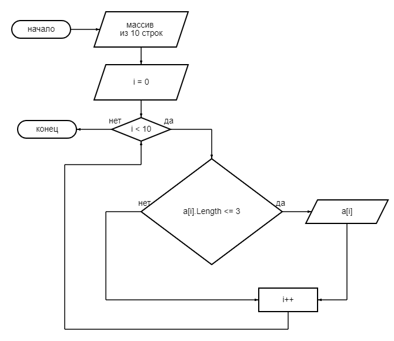

1. Создан репозиторий на GitHub
2. Блок-схема:

3. **Инструкция к написанной программе**
* Необходимо задать массив, состоящий из строк (цифры, слова). Переход к следующей строке осуществляется через Enter.
* После введения строк на экране появится полностью заданный массив.
* Затем программа выведет на экран все строки состоящие из 0-3 символов.